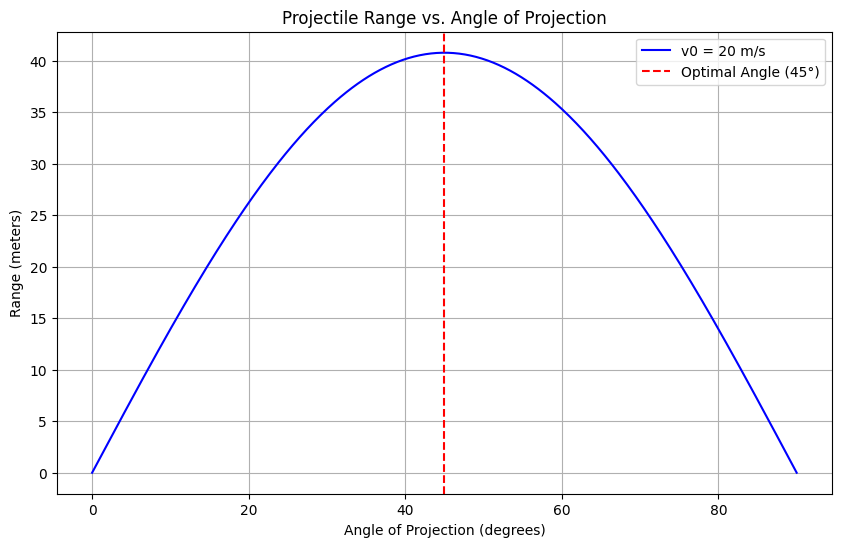
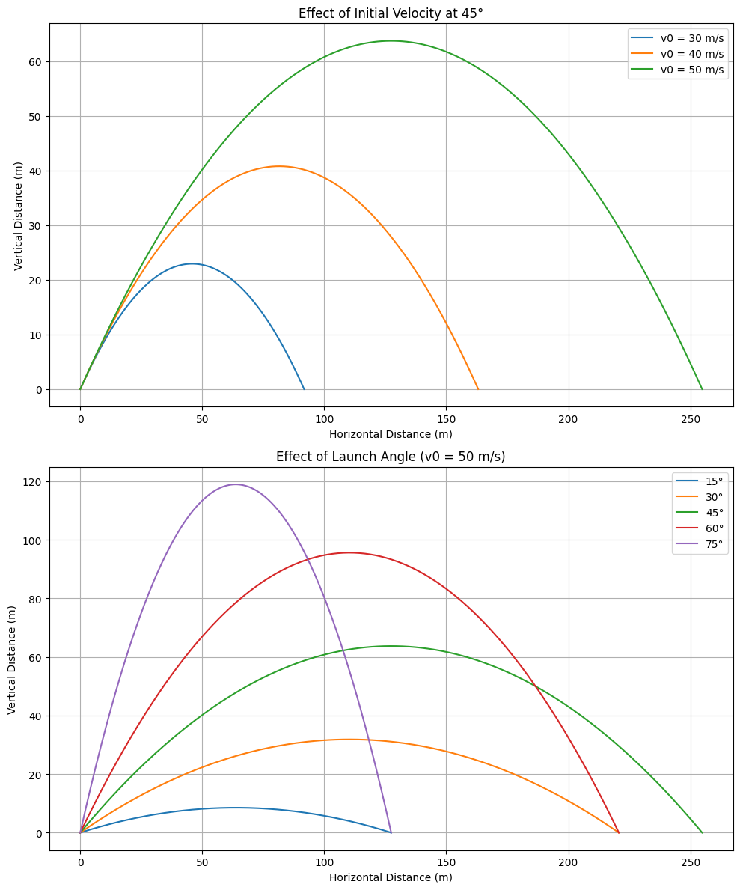
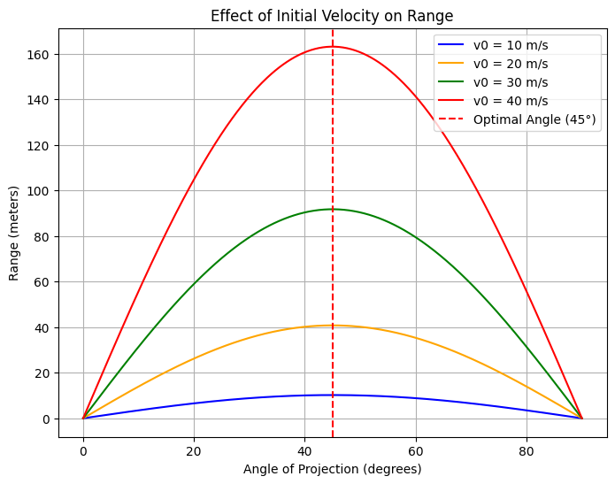
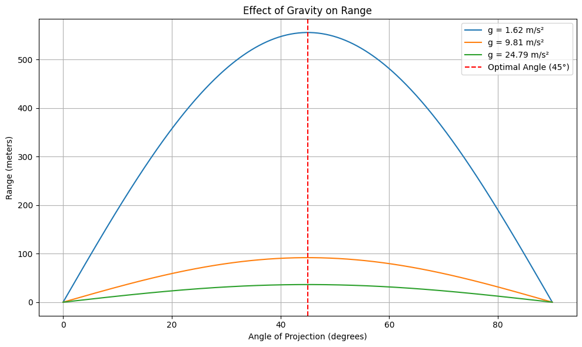
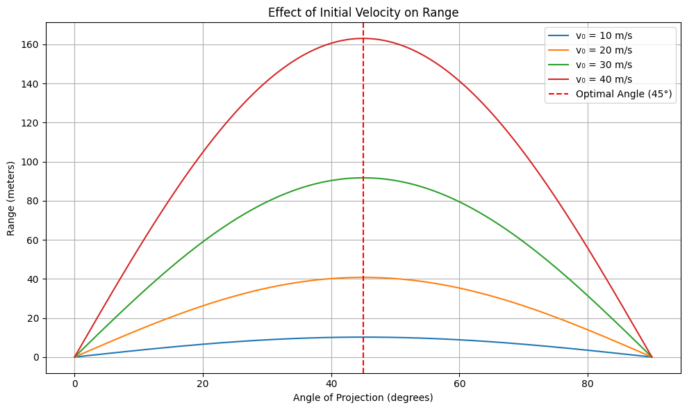

# Problem 1
# Theoretical Foundation of Projectile Motion

Projectile motion, governed by Newtonian mechanics, offers an ideal framework to explore the interplay between initial conditions and resulting trajectories. This derivation begins from first principles.

---

## 1. Assumptions

- No air resistance.
- Two-dimensional motion: horizontal (x) and vertical (y).
- Constant gravitational acceleration $g$, directed downward.

---

## 2. Governing Equations from Newton's Second Law

Newton’s Second Law:

$$
\vec{F} = m\vec{a}
$$

Only force: gravity  
Acceleration vector:

$$
\vec{a} = \begin{pmatrix} 0 \\ -g \end{pmatrix}
$$

---

### (a) Horizontal Motion

$$
\frac{d^2x}{dt^2} = 0
$$

Integrate:

$$
\frac{dx}{dt} = v_{0x} = v_0 \cos\theta
$$

$$
x(t) = v_0 \cos\theta \cdot t
$$

---

### (b) Vertical Motion

$$
\frac{d^2y}{dt^2} = -g
$$

Integrate:

$$
\frac{dy}{dt} = -gt + v_{0y} = -gt + v_0 \sin\theta
$$

$$
y(t) = -\frac{1}{2}gt^2 + v_0 \sin\theta \cdot t + h_0
$$

---

## 3. Trajectory Equation

Eliminate $t$ using:

$$
t = \frac{x}{v_0 \cos\theta}
$$

Substitute into $y(t)$:

$$
y(x) = -\frac{g x^2}{2 v_0^2 \cos^2\theta} + x \tan\theta + h_0
$$

This is a parabolic equation.

---

## 4. Range of the Projectile

Range $ R $: the horizontal distance when $y = 0$
Set vertical equation to zero:

$$
0 = -\frac{1}{2}gt^2 + v_0 \sin\theta \cdot t + h_0
$$

Solve for time of flight $T$:

$$
\frac{1}{2}gt^2 - v_0 \sin\theta \cdot t - h_0 = 0
$$

Use positive root $T$, then compute:

$$
R = v_0 \cos\theta \cdot T
$$

---

## 5. Influence of Initial Conditions

Three parameters define the motion:

- **Initial velocity $ v_0 $**: Affects height, range, and time.
- **Angle of projection $ \theta $**: Controls the division between horizontal and vertical speeds.
- **Launch height $ h_0 $**: Alters flight time and horizontal distance.

By varying these, a family of trajectories emerges:
- Lower $\theta$: flatter arcs, shorter airtime.
- Higher $v_0$: longer range, higher apex.
- Higher $h_0$: increased flight duration and range.

---
# Analysis of the Range in Projectile Motion

In this section, we analyze how the **horizontal range** of a projectile depends on the **angle of projection** and other initial parameters like **initial velocity** and **gravitational acceleration**.

---

## 1. General Formula for Range

The horizontal range $R$ is the distance a projectile travels along the x-axis before hitting the ground. For a projectile launched from height $h_0 = 0$, the range is given by:

$$
R = \frac{v_0^2 \sin(2\theta)}{g}
$$

where:
- $v_0$ is the initial speed,
- $\theta$ is the angle of projection,
- $g$ is the gravitational acceleration.

---

## 2. Dependence on Angle of Projection $ \theta $

From the formula:

$$
R(\theta) = \frac{v_0^2}{g} \sin(2\theta)
$$

### Key observations:
- The function $\sin(2\theta)$ reaches its maximum value of 1 when $2\theta = 90^\circ $, i.e.,$\theta = 45^\circ$.
- Therefore, the range is **maximum when the angle of projection is 45°**, assuming level ground and no air resistance.
- The graph of $R(\theta)$ is **symmetric about 45°**. That is, $R(30^\circ) = R(60^\circ)$, $R(20^\circ) = R(70^\circ)$, and so on.

---

## 3. Influence of Initial Velocity $ v_0 $

Range is **quadratically proportional** to the initial velocity:

$$
R \propto v_0^2
$$

Doubling $v_0$ results in **four times the range**, assuming $\theta$ and $g$ remain constant.

---

## 4. Influence of Gravitational Acceleration $g$

Range is **inversely proportional** to gravitational acceleration:

$$
R \propto \frac{1}{g}
$$

- On planets with lower gravity (e.g., the Moon), the same projectile launched with the same $v_0$ and $\theta$ will travel **farther**.
- Conversely, on planets with stronger gravity, the range will be **shorter**.

---

## 5. Non-Zero Launch Height Case

If the projectile is launched from a height $h_0 \ne 0$, the formula becomes more complex. The time of flight $T$ is found by solving:

$$
y(t) = -\frac{1}{2}gt^2 + v_0 \sin\theta \cdot t + h_0 = 0
$$

Using the positive root of this quadratic gives $T$, then:

$$
R = v_0 \cos\theta \cdot T
$$

In this case:
- The maximum range no longer occurs exactly at 45°.
- It shifts slightly depending on $h_0$ and the relative contribution of vertical motion.

---

## 6. Summary

| Parameter         | Effect on Range                                  |
|------------------|--------------------------------------------------|
| Angle $\theta$ | Maximum range at $45^\circ$ (if $h_0 = 0$)   |
| Initial speed $v_0$ | $ R \propto v_0^2$                          |
| Gravity $g$     | $R\propto \frac{1}{g}$                        |
| Launch height $h_0$ | Increases range and shifts optimal angle    |

---

This analysis demonstrates how a seemingly simple equation provides rich insight through variations in its parameters. Would you like a graph showing how range varies with angle or velocity?

# Practical Applications of Projectile Motion

While the idealized model of projectile motion assumes a vacuum and level ground, real-world scenarios often introduce complexities. Adapting the basic model allows us to analyze more realistic situations with remarkable accuracy.

---

## 1. Projectiles on Uneven Terrain

In real life, projectiles are rarely launched and land on perfectly flat surfaces. For **uneven terrain**, the landing height differs from the launch height ($h_0 \ne 0$).

### Adaptation:
Use the full vertical motion equation:

$$
y(t) = -\frac{1}{2}gt^2 + v_0 \sin\theta \cdot t + h_0
$$

Set $ y(t) = h_f $ (final height) and solve the resulting quadratic for $t$. Then compute the range:

$$
R = v_0 \cos\theta \cdot t
$$

### Applications:
- **Mountainous warfare**: Artillery fired from or into elevated terrain.
- **Golf**: Hitting from an uphill or downhill slope.
- **Rescue operations**: Airdropping supplies onto elevated platforms.

---

## 2. Air Resistance

Air resistance (drag) significantly alters projectile behavior, especially at high speeds.

### Drag Force Model:
A common linear approximation for low-speed motion:

$$
F_{\text{drag}} = -kv
$$

Or for higher speeds (quadratic drag):

$$
F_{\text{drag}} = -kv^2
$$

These forces act opposite to the direction of motion and modify the differential equations:

- In the horizontal direction:

  $$
  m\frac{dv_x}{dt} = -kv_x \quad \Rightarrow \quad v_x(t) = v_{0x} e^{-\frac{k}{m}t}
  $$

- In the vertical direction:

  $$
  m\frac{dv_y}{dt} = -mg - kv_y
  $$

These equations usually require **numerical methods** for solutions.

### Effects of Air Resistance:
- Reduces range.
- Lowers maximum height.
- Optimal angle is **less than 45°**, often around 35–40° depending on drag strength.

---

## 3. Wind and Environmental Effects

Wind adds a horizontal force component, effectively altering $v_0 \cos\theta$ or even changing direction mid-flight. Temperature and air density can also modify drag forces.

### Applications:
- **Ballistics**: Adjusting fire for crosswinds or atmospheric pressure.
- **Aviation**: Trajectory planning for dropped payloads or flare deployments.

---

## 4. Rotating Planet (Coriolis Effect)

For long-range trajectories (e.g., missiles or long-range artillery), Earth’s rotation introduces the **Coriolis force**, which causes deflection depending on latitude and direction.

### Application:
- **Military and aerospace targeting**: Long-range accuracy requires Coriolis corrections.
- **Meteorology**: Wind and storm patterns are influenced by Coriolis dynamics.

---

## 5. Sports and Engineering Design

Projectile principles are applied in:
- **Sports**: Analyzing ball flight in basketball, soccer, or javelin.
- **Engineering**: Designing water fountains, roller coasters, or jump ramps.
- **Robotics**: Launching projectiles or packages with precision.

---

## Summary

| Real-World Factor        | Modification Needed                     |
|--------------------------|------------------------------------------|
| Uneven terrain           | Adjust final height in motion equations |
| Air resistance           | Add velocity-dependent drag forces      |
| Wind                     | Include lateral forces                  |
| Earth's rotation         | Account for Coriolis force              |
| High-speed motion        | Use numerical solvers for accuracy      |

---

Realistic projectile modeling requires adapting the core equations to specific environments and constraints. Despite the complexity, the foundational model remains a powerful starting point.

# Implementation of a Projectile Motion Simulator

This task involves developing a computational tool to simulate projectile motion and **visualize how the range varies** with the **angle of projection** under different initial conditions.

---

## 1. Objective

- Simulate projectile motion using basic physics principles.
- Plot **range vs. projection angle**.
- Explore how changes in:
  - Initial velocity ($v_0$)
  - Launch height ($h_0$)
  - Gravitational acceleration ($g$)  
affect the projectile's range.

---

## 2. Methodology

### Inputs:
- Initial velocity $v_0$
- Launch height $h_0$
- Angle of projection $\theta$
- Gravitational acceleration $g$

### Approach:
1. Loop over projection angles $\theta$ from 1° to 89°.
2. For each angle:
   - Compute horizontal and vertical velocity components.
   - Solve for time of flight by setting vertical displacement $y(t) = 0$.
   - Use the positive root of the quadratic equation.
   - Compute horizontal range: $R = v_0 \cos\theta \cdot T$.
3. Plot range as a function of angle.

# Visualizations

 