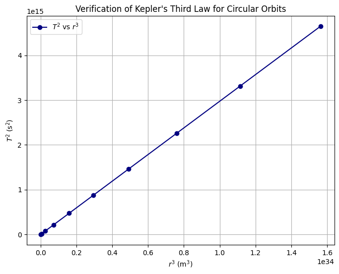

# Derivation of Kepler's Third Law for Circular Orbits

Kepler's Third Law states that the square of the orbital period of a planet is proportional to the cube of the semi-major axis (orbital radius for circular orbits). We derive this relationship using Newtonian mechanics.

---

##  Equating Gravitational Force and Centripetal Force

For a small body of mass $m$ orbiting a much larger body of mass $M$ in a circular orbit of radius $r$:

$$\frac{G M m}{r^2} = \frac{m v^2}{r}$$

Where:
- $ G $: Gravitational constant
- $ v $: Orbital speed
- $ m $: Mass of the orbiting body (cancels out)
- $ M $: Mass of the central object

---

##  Simplify the Equation

Canceling $m$ from both sides:

$$
\frac{G M}{r^2} = \frac{v^2}{r}
\Rightarrow v^2 = \frac{G M}{r}
$$

---

##  Express Orbital Period in Terms of Velocity

The orbital period $T$ is:

$$
T = \frac{2\pi r}{v} \Rightarrow v = \frac{2\pi r}{T}
$$

Substitute into the equation for $v^2$:

$$
\left( \frac{2\pi r}{T} \right)^2 = \frac{G M}{r}
$$

---

##  Simplify and Solve for $T^2$

$$
\frac{4\pi^2 r^2}{T^2} = \frac{G M}{r}
\Rightarrow \frac{4\pi^2 r^3}{T^2} = G M
\Rightarrow T^2 = \frac{4\pi^2}{G M} r^3
$$

---

## Final Result

$$
T^2 \propto r^3
$$

This is Kepler's Third Law. The constant of proportionality is $\frac{4\pi^2}{G M}$, which depends on the mass $M$ of the central body.

# Implications of Kepler's Third Law in Astronomy

Kepler's Third Law,

$$
T^2 = \frac{4\pi^2}{G M} \cdot r^3,
$$

has several important implications for astronomy, particularly in understanding planetary systems and calculating key physical quantities.

## 1. Determining Planetary Masses

- For planets orbiting a star, if we know the orbital period $T$ and orbital radius $r$, we can rearrange the law to solve for the mass $M$ of the central body (e.g., a star):

  $$
  M = \frac{4\pi^2 r^3}{G T^2}.
  $$

- This allows astronomers to estimate the mass of stars or planets indirectly by observing the orbits of their satellites or companion bodies, without needing to physically visit them.

## 2. Calculating Distances in Space

- Kepler's Third Law provides a fundamental relationship to infer distances in the solar system and beyond.
- By measuring the orbital period of a planet or satellite, astronomers can calculate the radius of its orbit, which translates directly to distance.
- This method is especially useful when direct measurement of distances is difficult or impossible.

## 3. Understanding Gravitational Interactions

- The law highlights the role of gravity in governing orbital motion.
- Deviations from the expected relationship can indicate the presence of additional bodies, unseen mass (e.g., dark matter), or perturbations in the system.
- It serves as a tool to study complex gravitational systems like binary stars, exoplanets, and galaxy rotations.

## 4. Establishing the Scale of the Solar System

- Historically, Kepler's Third Law was key to establishing the relative sizes of planetary orbits.
- Combined with measurements of the Earth-Sun distance (the astronomical unit), it helps define the scale of the entire solar system.

---

Overall, Kepler's Third Law acts as a bridge between observable orbital characteristics and fundamental physical properties, enabling a deeper understanding of celestial mechanics and the structure of the universe.

# Real-World Examples of Kepler's Third Law

## 1. The Moon's Orbit Around Earth

- The Moon orbits the Earth roughly every $T = 27.3$ days (about $2.36 \times 10^6$ seconds).
- The average orbital radius is approximately $r = 3.84 \times 10^8$ meters.
- Using Kepler's Third Law,

  $$
  T^2 = \frac{4\pi^2}{G M_\text{Earth}} \cdot r^3,
  $$

  where $G = 6.674 \times 10^{-11} \, \mathrm{m^3\,kg^{-1}\,s^{-2}}$ and $M_\text{Earth} \approx 5.97 \times 10^{24} \, \mathrm{kg}$.

- This relationship confirms the mass of Earth and validates gravitational theory by matching observed orbital data.

## 2. Planets in the Solar System

- For planets orbiting the Sun, Kepler's Third Law can be written as

  $$
  T^2 = \frac{4\pi^2}{G M_\odot} \cdot r^3,
  $$

  where $M_\odot \approx 1.989 \times 10^{30} \, \mathrm{kg}$ is the Sun's mass.

- Example: Earth  
  - Orbital period $T = 1$ year ($3.15 \times 10^7$ seconds)  
  - Average orbital radius $r = 1.496 \times 10^{11}$ meters (1 astronomical unit, AU)

- Using these values, the constant $\frac{4\pi^2}{G M_\odot}$ is consistent across all planets, meaning

  $$
  \frac{T^2}{r^3} \approx \text{constant}.
  $$

- This allows astronomers to estimate unknown distances or periods of other planets and satellites by comparing them to Earth’s known orbit.

## 3. Application to Exoplanets and Satellites

- When astronomers detect exoplanets by observing star wobble or transit timing, Kepler’s Third Law helps determine the exoplanet’s orbital radius or the star’s mass.
- Similarly, artificial satellites orbiting Earth follow this law, enabling precise predictions of their trajectories.

---

These real-world applications demonstrate the power of Kepler’s Third Law to connect observational data with fundamental physical properties across diverse celestial systems.

# Computational Model to Simulate Circular Orbits and Verify Kepler's Third Law

The goal is to simulate a small body orbiting a massive central body in a circular orbit and verify that the orbital period squared $T^2$ is proportional to the orbital radius cubed $r^3$.

---

## Model Description

- Assume a central mass \( M \) and a test particle orbiting at radius \( r \).
- Gravitational force provides centripetal acceleration:

  $$
  \frac{G M}{r^2} = \frac{v^2}{r}.
  $$

- Orbital speed:

  $$
  v = \sqrt{\frac{G M}{r}}.
  $$

- Orbital period:

  $$
  T = \frac{2 \pi r}{v} = 2 \pi \sqrt{\frac{r^3}{G M}}.
  $$

We will simulate orbits for different radii and compute the periods numerically, then compare \( T^2 \) vs \( r^3 \).

## Here is  A Simulation of Circular Orbits and Verification of Kepler's Third Law

