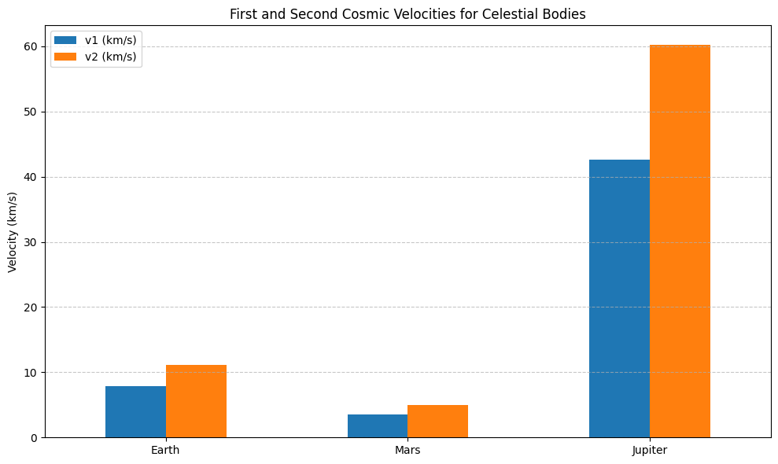

# Cosmic Velocities: Definitions and Physical Meaning

Understanding the cosmic velocities is essential for grasping how objects move in and beyond the gravitational field of a celestial body such as Earth. These velocities determine whether an object will orbit the planet, escape its gravity, or even leave the gravitational influence of the entire solar system.

## 1. First Cosmic Velocity (Orbital Velocity)

- **Definition**: The minimum velocity required for an object to enter a stable circular orbit around a celestial body just above its surface.
- **Formula**:  
  $$
  v_1 = \sqrt{\frac{GM}{R}}
  $$
  where:
  - $ G $ is the gravitational constant,
  - $ M $ is the mass of the celestial body,
  - $ R $ is the radius of the body.

- **Physical Meaning**: At this speed, an object does not fall back to the planet because the gravitational pull is perfectly balanced by the centrifugal force of the circular motion. For Earth, this velocity is approximately **7.9 km/s**.

## 2. Second Cosmic Velocity (Escape Velocity)

- **Definition**: The minimum velocity required to escape the gravitational field of a celestial body without further propulsion.
- **Formula**:  
  $$
  v_2 = \sqrt{2} \cdot v_1 = \sqrt{\frac{2GM}{R}}
  $$

- **Physical Meaning**: At this speed, an object overcomes the gravitational pull completely and moves away into space without falling back. For Earth, this velocity is approximately **11.2 km/s**.

## 3. Third Cosmic Velocity (Heliocentric Escape Velocity)

- **Definition**: The minimum velocity required to escape the gravitational influence of the Sun, starting from the Earth's orbit.
- **Formula** (approximate, depends on initial position and velocity relative to the Sun):  
  $$
  v_3 \approx 16.7 \, \text{km/s} \text{ (relative to the Sun)}
  $$

- **Physical Meaning**: This is the speed needed for a spacecraft to leave the solar system entirely, escaping the Sun's gravitational influence. It is relevant for interstellar missions such as Voyager 1 and 2.

---

These cosmic velocities form the theoretical foundation for space missions, satellite deployment, and long-distance interplanetary and interstellar exploration.

# Mathematical Analysis of Cosmic Velocities

The three cosmic velocities are derived from classical mechanics and Newtonian gravity. Each velocity depends on fundamental parameters such as the gravitational constant ($ G $), the mass of the celestial body ($ M $), and the radial distance ($ R $) from its center.

---

## 1. First Cosmic Velocity (Orbital Velocity)

### Derivation:

An object in a stable circular orbit experiences a centripetal force provided by gravity:

$$
\frac{mv^2}{R} = \frac{GMm}{R^2}
$$

Canceling $ m $ and solving for $ v $:

$$
v_1 = \sqrt{\frac{GM}{R}}
$$

### Parameters Affecting $ v_1 $:
- **$ G $**: Universal constant, does not vary.
- **$ M $**: A more massive body (like Jupiter) increases $ v_1 $.
- **$ R $**: A higher orbit (larger $ R $) decreases $ v_1 $.

---

## 2. Second Cosmic Velocity (Escape Velocity)

### Derivation:

Escape velocity is found by equating kinetic energy to gravitational potential energy:

$$
\frac{1}{2}mv^2 = \frac{GMm}{R}
$$

Solving for $ v $:

$$
v_2 = \sqrt{\frac{2GM}{R}} = \sqrt{2} \cdot v_1
$$

### Parameters Affecting $ v_2 $:
- Directly depends on $ M $ and inversely on $ R $.
- Does **not** depend on the mass of the escaping object ($ m $ cancels out).
- A denser planet (larger $ M $, smaller $ R $) yields a higher $ v_2 $.

---

## 3. Third Cosmic Velocity (Heliocentric Escape Velocity)

### Conceptual Derivation:

To escape the solar system, a spacecraft must overcome the Sun’s gravity from Earth's orbital distance. Starting from the Sun's gravitational potential:

$$
v_3 = \sqrt{\frac{2GM_{\odot}}{r_{\text{Earth}}}} \approx 42.1 \, \text{km/s}
$$

However, Earth already moves at $ v_E \approx 29.8 \, \text{km/s} $ around the Sun. Therefore, the additional velocity needed from Earth’s surface is:

$$
v_3 = \sqrt{v_{\text{esc}}^2 + v_{\infty}^2}
$$

Where $ v_{\text{esc}} \approx 11.2 \, \text{km/s} $ (from Earth) and $ v_{\infty} $ is the excess velocity at infinity required to escape the Sun.

### Approximate Result:

$$
v_3 \approx 16.7 \, \text{km/s}
$$

(from Earth's surface, considering Earth’s orbital contribution).

### Parameters Affecting $ v_3 $:
- **$ M_{\odot} $** (mass of the Sun): Directly increases $ v_3 $.
- **$ r_{\text{Earth}} $**: Distance from the Sun; farther planets need less additional speed to escape the solar system.
- **Initial velocity relative to the Sun** (e.g., via gravitational slingshot) can reduce the fuel required to reach $ v_3 $.

---

## Summary Table

| Velocity        | Formula                        | Depends On                  | Earth Value (approx.) |
|-----------------|--------------------------------|------------------------------|------------------------|
| $ v_1 $         | $ \sqrt{\frac{GM}{R}} $        | $ G $, $ M $, $ R $         | 7.9 km/s              |
| $ v_2 $         | $ \sqrt{\frac{2GM}{R}} $       | $ G $, $ M $, $ R $         | 11.2 km/s             |
| $ v_3 $         | *Complex; solar system escape* | $ G $, $ M_{\odot} $, $ r $ | 16.7 km/s             |

---

Understanding the mathematical foundations and the dependence on physical parameters allows for the precise planning of space missions, efficient fuel usage, and exploration beyond Earth orbit.

# Calculate and visualize these velocities for different celestial bodies

| Celestial Body | First Cosmic Velocity (v₁) \[km/s] | Second Cosmic Velocity (v₂) \[km/s] |
| -------------- | ---------------------------------- | ----------------------------------- |
| Earth          | 7.91                               | 11.19                               |
| Mars           | 3.55                               | 5.03                                |
| Jupiter        | 42.57                              | 60.20                               |

## Visualization

# Importance of Cosmic Velocities in Space Exploration

Cosmic velocities form the foundation for understanding and planning virtually every aspect of space travel, from launching satellites to interplanetary and interstellar missions.

---

## Launching Satellites

- The **first cosmic velocity** is critical to placing satellites into stable orbits around Earth or other planets.
- Achieving this orbital velocity ensures satellites remain in continuous free-fall around the planet without falling back to the surface.
- This principle enables global communication, GPS systems, weather monitoring, and scientific observations.

---

## Missions to Other Planets

- The **second cosmic velocity** (escape velocity) defines the minimum speed a spacecraft must reach to leave a planet’s gravitational influence.
- Rockets and probes must exceed this velocity to travel from Earth into space and journey toward other planets such as Mars or Jupiter.
- Efficient fuel use and trajectory planning often leverage gravity assists to minimize the energy needed to reach or exceed escape velocity.

---

## Interstellar Travel and the Third Cosmic Velocity

- The **third cosmic velocity** represents the speed necessary to break free from the Sun’s gravitational pull entirely.
- This velocity is relevant for ambitious missions aiming to send probes beyond the solar system, such as the Voyager spacecraft.
- Understanding and achieving this velocity opens possibilities for exploring interstellar space and studying other star systems.

---

## Summary

By mastering the concepts and calculations of cosmic velocities, scientists and engineers can design effective propulsion systems, plan mission trajectories, and explore the universe beyond our planet — from Earth’s orbit to the far reaches of space.

# Conclusion

Cosmic velocities are key to understanding motion in space under gravity. The first cosmic velocity allows satellites to orbit Earth, supporting modern space infrastructure. The second enables escape from a planet’s gravity for interplanetary travel, while the third allows spacecraft to leave the solar system for interstellar missions.

Mastering these velocities is vital for space exploration, guiding rocket design, mission planning, and humanity’s journey from Earth’s orbit to the stars.
