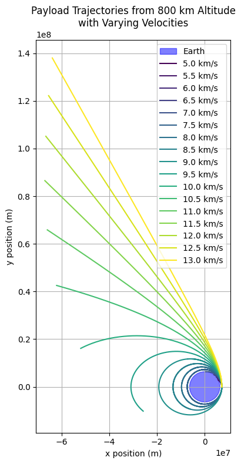
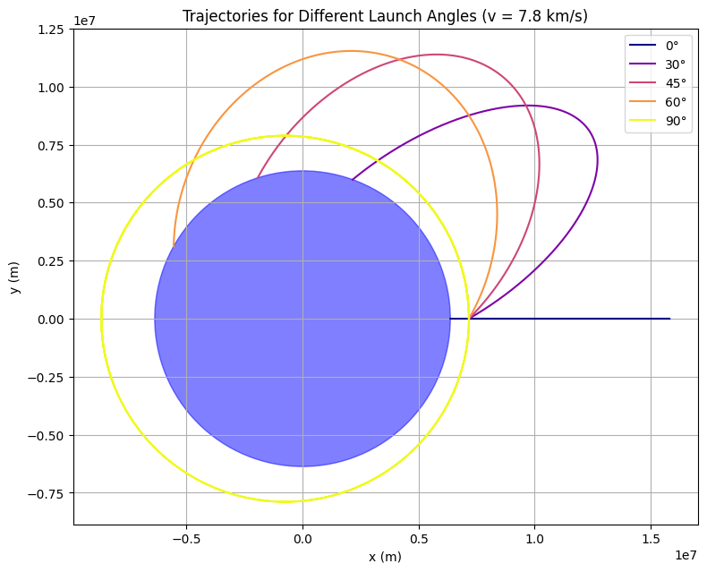
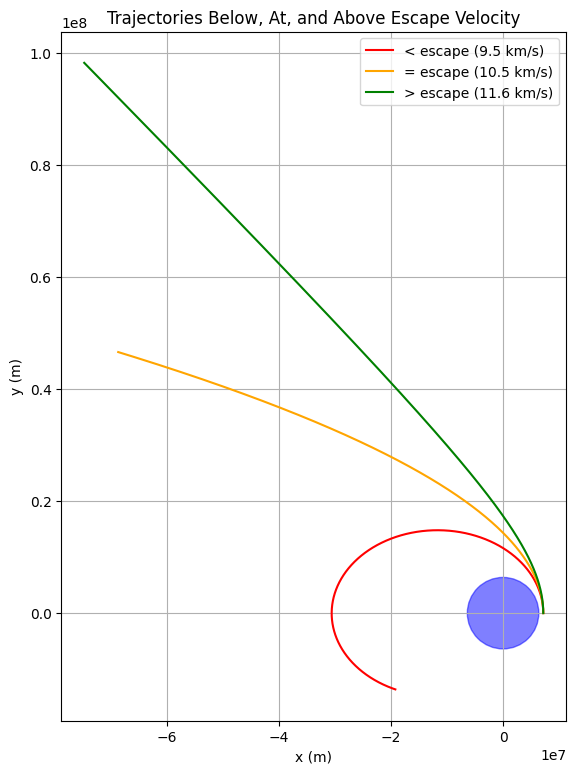

# Problem 3
# Possible Trajectories of a Payload Released Near Earth

When a payload is released from a moving rocket near Earth, its trajectory depends primarily on the initial velocity vector and altitude. The key factor determining the type of orbit or trajectory is the **specific orbital energy** $\epsilon$:

$$
\epsilon = \frac{v^2}{2} - \frac{GM}{r}
$$

where  
- $v$ = speed of the payload at release,  
- $r$ = distance from Earth’s center at release,  
- $G$ = gravitational constant,  
- $M$ = Earth’s mass.

---

## 1. Elliptical Orbit (Bound Orbit)

- Condition: $\epsilon < 0$  
- Interpretation: The payload’s speed is less than escape velocity at that altitude.  
- Result: The payload remains gravitationally bound to Earth, moving in a closed elliptical orbit around Earth.  
- Special case:  
  - If the orbit is circular, $v = v_{\text{circular}} = \sqrt{\frac{GM}{r}}$.  
  - Most orbits are elliptical with varying eccentricity.

---

## 2. Parabolic Trajectory (Escape Condition)

- Condition: $\epsilon = 0$  
- Interpretation: The payload has exactly the escape velocity at the release altitude.  
- Result: The trajectory is parabolic — the object barely escapes Earth’s gravity, theoretically never returning but moving away with zero excess speed at infinity.

---

## 3. Hyperbolic Trajectory (Unbound Orbit)

- Condition: $\epsilon > 0$  
- Interpretation: The payload’s speed is greater than escape velocity at release.  
- Result: The object escapes Earth’s gravity with excess speed, following a hyperbolic path.  
- This trajectory is typical for interplanetary missions or objects leaving Earth orbit permanently.

---

## Additional Notes

- **Escape velocity** at radius $r$ is given by:  
  $$
  v_{\text{escape}} = \sqrt{\frac{2GM}{r}}
  $$
- If released with velocity less than orbital velocity but still above zero, the payload may follow a **suborbital trajectory**, falling back to Earth.
- Real trajectories can be affected by atmospheric drag (especially at low altitudes) and Earth's oblateness or perturbations from other bodies.
- Numerical integration is often required to predict precise trajectories from complex initial conditions.

# Numerical Analysis of Payload Trajectory Near Earth

## Problem Setup

We want to compute the trajectory of a payload released from a moving rocket near Earth. The payload’s motion is governed by Newton’s law under Earth's gravity:

$$
\frac{d^2 \mathbf{r}}{dt^2} = -\frac{GM}{r^3} \mathbf{r}
$$

where:  
- $\mathbf{r} = (x, y)$ is the position vector from Earth's center,  
- $r = |\mathbf{r}| = \sqrt{x^2 + y^2}$,  
- $G$ is the gravitational constant,  
- $M$ is the mass of the Earth.

## Initial Conditions

- Initial position $\mathbf{r}_0 = (x_0, y_0)$, typically at altitude above Earth's surface.  
- Initial velocity $\mathbf{v}_0 = (v_{x0}, v_{y0})$, inherited from the rocket plus any relative velocity imparted on release.

## Numerical Integration Using RK4 Method

We rewrite the 2nd order ODE as a system of first order ODEs:

$$
\frac{d \mathbf{r}}{dt} = \mathbf{v}, \quad
\frac{d \mathbf{v}}{dt} = -\frac{GM}{r^3} \mathbf{r}
$$

# Relationship Between Trajectories and Space Mission Scenarios

When a payload is released near Earth, the nature of its trajectory—elliptical, parabolic, or hyperbolic—directly influences mission outcomes such as orbital insertion, reentry, or escape. Understanding this connection is key for mission planning.

---

## 1. Elliptical Orbits and Orbital Insertion

- **Trajectory Type:** Bound, closed elliptical orbits ($\epsilon < 0$)  
- **Scenario:** Payload achieves sufficient velocity and altitude to enter a stable orbit around Earth.  
- **Mission Relevance:**  
  - **Orbital insertion** requires the payload to be accelerated to near circular velocity for the desired altitude.  
  - Satellites and space stations use elliptical orbits as intermediate or operational orbits.  
  - Adjustments via propulsion (orbital maneuvers) can circularize or raise/lower orbits.  
- **Example:** Releasing a satellite from the rocket at the right velocity vector to achieve a long-lasting orbit.

---

## 2. Parabolic Trajectories and Escape Conditions

- **Trajectory Type:** Marginal escape path ($\epsilon = 0$)  
- **Scenario:** Payload has exactly escape velocity, moving on a parabolic path.  
- **Mission Relevance:**  
  - Represents the boundary between bound orbits and escape trajectories.  
  - Rarely targeted in missions because any small velocity increase leads to hyperbolic escape.  
  - Useful for theoretical studies of escape velocity.  
- **Example:** An object released at escape velocity moves away from Earth without returning but with zero excess speed at infinity.

---

## 3. Hyperbolic Trajectories and Escape Missions

- **Trajectory Type:** Unbound, open hyperbolic paths ($\epsilon > 0$)  
- **Scenario:** Payload exceeds escape velocity and leaves Earth’s gravitational influence.  
- **Mission Relevance:**  
  - Essential for **interplanetary missions** or probes leaving Earth orbit for other bodies.  
  - Requires higher initial velocity, often via multi-stage rockets or gravity assists.  
  - The payload has excess kinetic energy beyond what’s needed to just escape Earth.  
- **Example:** Voyager probes, missions to Mars or beyond use hyperbolic escape trajectories.

---

## 4. Suborbital Trajectories and Reentry

- **Trajectory Type:** Velocity less than orbital, but not zero (suborbital)  
- **Scenario:** Payload does not achieve orbital velocity and returns to Earth on a ballistic path.  
- **Mission Relevance:**  
  - Used for sounding rockets, reentry capsules, or testing payloads.  
  - Payload experiences atmospheric reentry and landing procedures.  
  - Careful trajectory planning is needed to control landing zone and heat loads.  
- **Example:** Capsules returning from orbit or suborbital test flights.

---

## Summary Table

| Trajectory Type      | Specific Energy $\epsilon$  | Mission Scenario        | Description                               |
|---------------------|-----------------------------|------------------------|-------------------------------------------|
| Elliptical Orbit     | $\epsilon < 0$              | Orbital insertion       | Stable orbit, payload remains bound       |
| Parabolic Trajectory | $\epsilon = 0$              | Marginal escape         | Exactly escape velocity, theoretical case |
| Hyperbolic Trajectory| $\epsilon > 0$              | Escape from Earth       | Payload leaves Earth gravity permanently  |
| Suborbital Trajectory| Velocity $<$ orbital speed  | Reentry and testing     | Payload falls back to Earth                |

---

Understanding these relationships allows mission planners to tailor release velocities and angles, ensuring the payload follows the desired trajectory to meet mission goals.

---

#  Three Cosmic Velocities: Summary

## 1. Velocity Table

| Velocity Type                     | Formula                                   | Earth (km/s) | Use Case                                                           |
|----------------------------------|--------------------------------------------|--------------|--------------------------------------------------------------------|
| **1st Cosmic Velocity** (Orbital)     | $$ v_1 = \sqrt{\frac{GM}{R}} $$              | **7.91 km/s** | Achieve **low Earth orbit (LEO)**; e.g., satellites like the ISS    |
| **2nd Cosmic Velocity** (Escape Earth) | $$ v_2 = \sqrt{2} \cdot v_1 $$                 | **11.2 km/s** | Escape **Earth’s gravity**; e.g., Apollo missions, lunar probes     |
| **3rd Cosmic Velocity** (Escape Sun)  | $$ v_3 = \sqrt{\frac{2GM_\odot}{r_{\text{Earth}}}} $$ | **42.1 km/s** | Escape **Solar System** from Earth’s orbit; e.g., Voyager missions  |

---

## 2. Planetary Comparison

| Body     | Radius (km) | Mass (kg)             | 1st Cosmic (km/s) | 2nd Cosmic (km/s) |
|----------|-------------|------------------------|-------------------|-------------------|
| Earth    | 6371        | $$5.97 \times 10^{24}$$ | 7.91              | 11.2              |
| Moon     | 1737        | $$7.35 \times 10^{22}$$ | 1.68              | 2.38              |
| Mars     | 3390        | $$6.42 \times 10^{23}$$ | 3.55              | 5.03              |
| Jupiter  | 69911       | $$1.90 \times 10^{27}$$ | 42.1              | 59.5              |

---

## 3. Use Case Summary

| Mission Goal                        | Required Velocity         | Explanation                                                       |
|------------------------------------|---------------------------|-------------------------------------------------------------------|
| Put satellite in Earth orbit       | $$v > v_1 \approx 7.91$$ km/s | Needed for artificial satellites, space stations                  |
| Send probe to Moon or Mars         | $$v > v_2 \approx 11.2$$ km/s | Needed to escape Earth’s gravity                                 |
| Leave Solar System                 | $$v > v_3 \approx 42.1$$ km/s | Spacecraft like **Voyager 1 & 2** use gravity assists             |
| Land and return from the Moon      | $$v_2 \approx 2.38$$ km/s   | Easier due to Moon’s lower gravity                               |
| Enter low Mars orbit               | $$v_1 \approx 3.55$$ km/s   | For satellites like **Mars Reconnaissance Orbiter**              |
| Return from Jupiter mission        | $$v_2 \approx 59.5$$ km/s   | Requires **multiple gravity assists** to overcome strong gravity |

---

### Some visuals

#### Projectile Trajectories from 800 km Altitude

#### Show effect of angle on trajectory

#### Compare Escape vs Non-Escape Velocities

