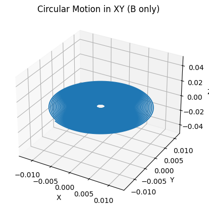
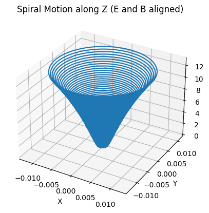
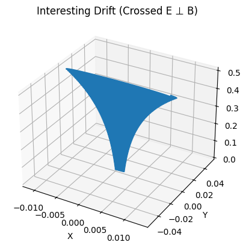
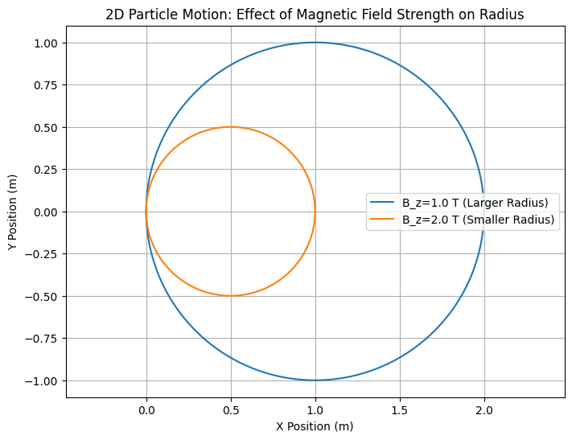
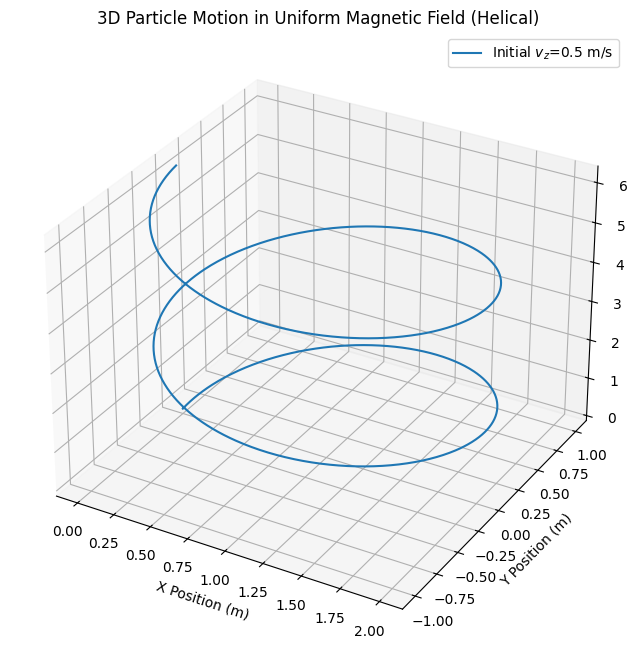
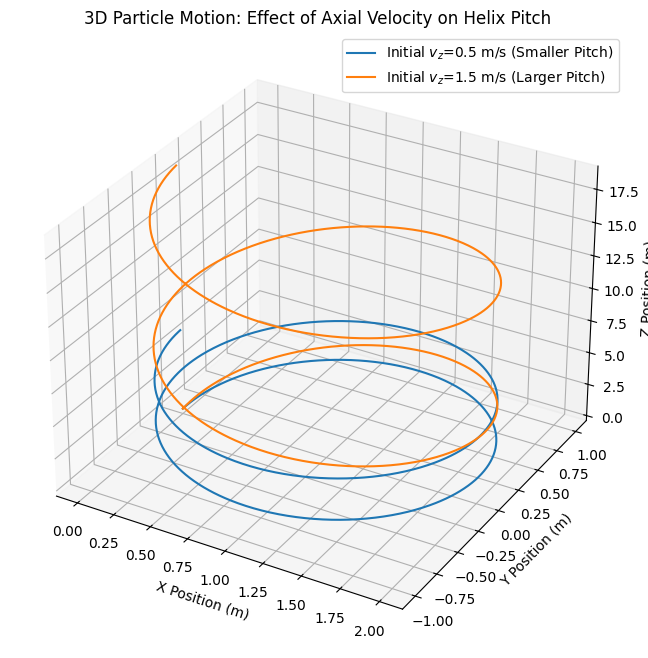
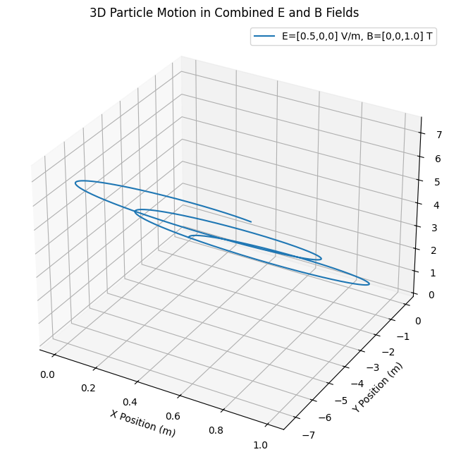
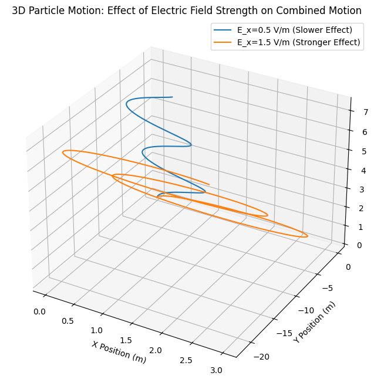

# Problem 1

## Key Systems Where the Lorentz Force Plays a Crucial Role

The Lorentz force, described by the equation

$$
\mathbf{F} = q\mathbf{E} + q\mathbf{v} \times \mathbf{B}
$$

is central to many physical systems and technologies. It governs the motion of charged particles under the influence of electric ($\mathbf{E}$) and magnetic ($\mathbf{B}$) fields. Below are some systems where this force is especially critical:

### 1. Particle Accelerators

In particle accelerators such as synchrotrons and cyclotrons, the Lorentz force is used to steer and accelerate particles. 

- **Electric fields ($\mathbf{E}$)** are responsible for accelerating the charged particles.
- **Magnetic fields ($\mathbf{B}$)** are used to bend and focus the particle beams along desired paths.

This interplay enables particles to reach high velocities and collide at controlled points for high-energy physics experiments.

### 2. Mass Spectrometers

Mass spectrometers use the Lorentz force to separate ions based on their mass-to-charge ratio ($m/q$). 

- Particles enter a region with a magnetic field $\mathbf{B}$ and are deflected in circular paths.
- The radius of the path depends on the particle’s velocity, charge, and mass:
  
  $$
  r = \frac{mv}{qB}
  $$

- By measuring this radius, the system identifies and characterizes different ions in a sample.

### 3. Plasma Confinement in Fusion Reactors

In devices like **tokamaks** and **stellarators**, magnetic fields are used to confine high-temperature plasma.

- **Charged particles spiral** around magnetic field lines due to the $q\mathbf{v} \times \mathbf{B}$ component.
- Electric fields may be applied to induce additional control or heating.

This confinement is essential to sustain the conditions necessary for nuclear fusion.

---

## Role of Electric and Magnetic Fields

- **Electric Field ($\mathbf{E}$):** 
  - Directly accelerates charged particles in a straight line.
  - Responsible for energy gain and directional control.

- **Magnetic Field ($\mathbf{B}$):**
  - Does not do work but changes the particle’s direction.
  - Causes circular or helical motion, crucial for confinement and steering.

Together, these fields allow precise control over the trajectories, speeds, and energies of charged particles in various applications.

## 🔍 Parameter Exploration

Explore how varying the **electric field ($\mathbf{E}$)**, **magnetic field ($\mathbf{B}$)**, **initial velocity ($\mathbf{v}_0$)**, and particle **charge ($q$)** and **mass ($m$)** influences the trajectory of a charged particle under the Lorentz force.

---

### 💡 Governing Equation

The motion of a charged particle is governed by the Lorentz force:

$$
\mathbf{F} = q(\mathbf{E} + \mathbf{v} \times \mathbf{B})
$$

This force results in acceleration given by Newton's second law:

$$
\mathbf{a} = \frac{\mathbf{F}}{m} = \frac{q}{m}(\mathbf{E} + \mathbf{v} \times \mathbf{B})
$$

---

### 🔁 Parameters to Vary

| Parameter         | Symbol        | Description                             | Effect on Trajectory                                   |
|------------------|---------------|-----------------------------------------|--------------------------------------------------------|
| Electric field    | $\mathbf{E}$  | Direction and strength of field         | Causes linear acceleration along $\mathbf{E}$          |
| Magnetic field    | $\mathbf{B}$  | Direction and strength of field         | Causes circular or helical motion perpendicular to $\mathbf{B}$ |
| Initial velocity  | $\mathbf{v}_0$| Starting speed and direction            | Determines initial energy and pitch of helical motion  |
| Charge            | $q$           | Sign and magnitude of charge            | Affects force direction (sign) and magnitude           |
| Mass              | $m$           | Inertia of the particle                 | Higher mass reduces acceleration under same force      |

---

### 🧪 Observational Outcomes

- **Increasing $|\mathbf{B}|$** tightens the radius of circular motion:

  $$
  r = \frac{mv_\perp}{qB}
  $$

- **Increasing $|\mathbf{E}|$** increases linear acceleration along the field direction.

- **Changing $q$ sign** reverses the direction of gyration or drift.

- **Reducing $m$** results in quicker response to field changes (higher acceleration).

- **Crossed Fields ($\mathbf{E} \perp \mathbf{B}$)** lead to drift motion with constant velocity:

  $$
  \mathbf{v}_{\text{drift}} = \frac{\mathbf{E} \times \mathbf{B}}{B^2}
  $$

---

### Visualization

## Google Colab

[Visit my Colab](https://colab.research.google.com/drive/1lUl-CljO9X4lzOJ98iXc_qiuS8wRgkmJ?usp=sharing)