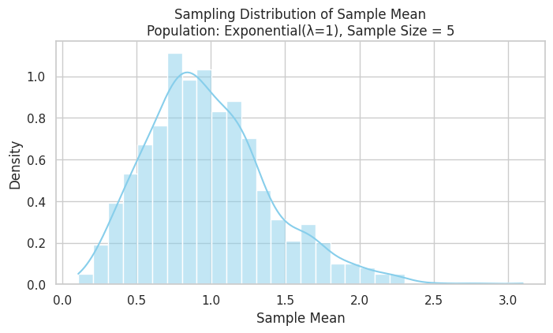

# Problem 1

# Simulating the Central Limit Theorem (CLT)

## 1. Population Distributions

Select several types of population distributions to observe how the Central Limit Theorem (CLT) applies across different shapes:

- **Uniform distribution**
- **Exponential distribution**
- **Binomial distribution**

For each distribution, generate a large dataset (e.g., 100,000 data points) to represent the population.

---

## 2. Sampling and Visualization

For each population:

- Randomly sample data and calculate the **sample mean** for different sample sizes:
  - Sample sizes: 5, 10, 30, 50
- Repeat the sampling process (e.g., 1,000 times) to build a **sampling distribution of the sample mean**
- Plot **histograms** of the sample means for each sample size to observe convergence to a normal distribution

> Observe how the shape of the sampling distribution becomes more bell-shaped (normal) as sample size increases.

---

## 3. Parameter Exploration

- **Shape Influence**: Compare how the original population shape affects convergence:
  - Uniform converges quickly
  - Exponential (skewed) converges slower
  - Binomial depends on $n$ and $p$
  
- **Sample Size Influence**: Larger samples yield sampling distributions closer to normal

- **Variance Effect**:
  - Recall the standard deviation of the sampling distribution is:
    $$\sigma_{\bar{x}} = \frac{\sigma}{\sqrt{n}}$$
  - Larger population variance $\sigma^2$ leads to wider sampling distributions
  - Increasing $n$ reduces the spread due to the denominator $\sqrt{n}$

---

## 4. Practical Applications of the CLT

- **Estimating Population Parameters**:
  - Enables construction of confidence intervals and hypothesis tests

- **Quality Control**:
  - Used in process monitoring with control charts

- **Finance and Risk Modeling**:
  - Underpins models that assume normality of returns or residuals

> The CLT justifies the widespread use of the normal distribution in statistical inference, even when the data itself is not normally distributed.

## Visualization

Population: Uniform(0,1)

Population: Exponential(λ=1)

Population: Binomial(n=10, p=0.5)

## Colab

[Visit my colab](https://colab.research.google.com/drive/1PQEwtp6Q4Bm_-ckv-XRlxrCeSY__NrRl?usp=sharing)

