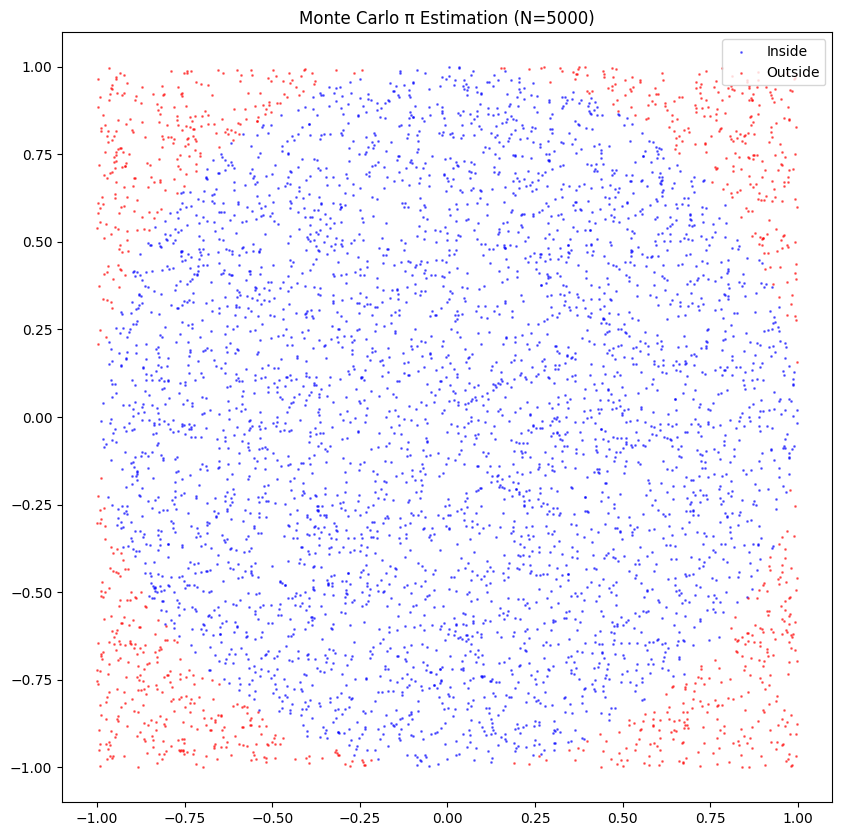
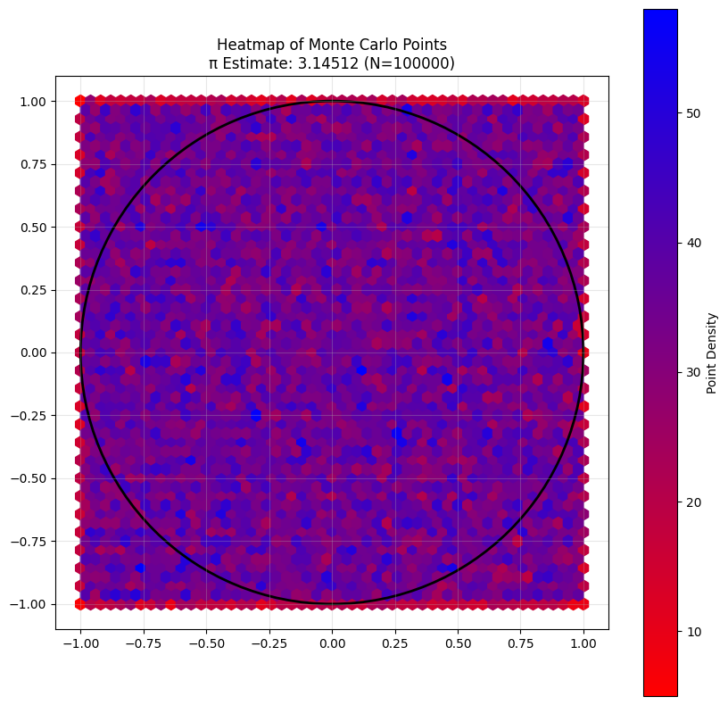
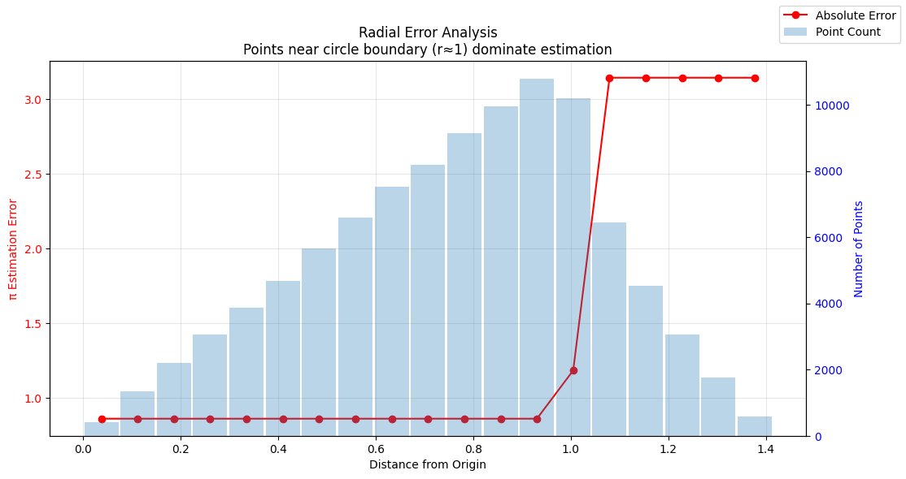
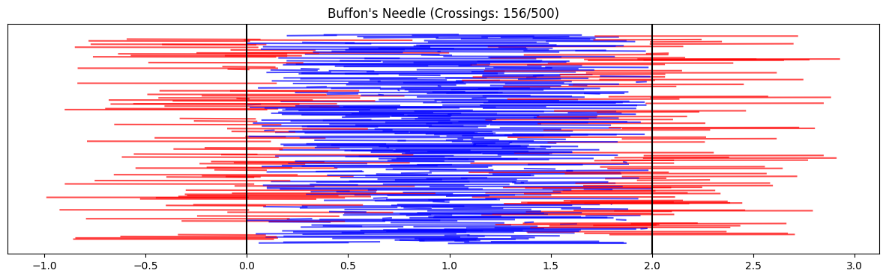
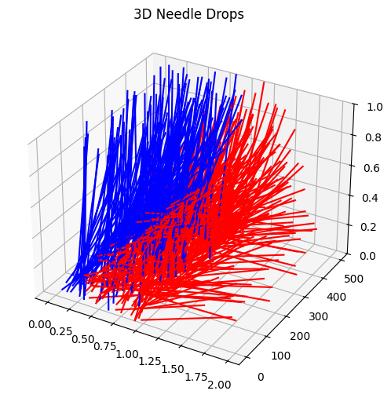

# Problem 2

# Estimating $\pi$ Using Monte Carlo Methods

## 1. Theoretical Foundation:

- Explain how the ratio of points inside a circle to the total number of points in a square can be used to estimate $\pi$.  
- Derive the formula $$\pi \approx 4 \cdot \left( \frac{\text{points inside the circle}}{\text{total points}} \right)$$ for a unit circle.

## 2. Simulation:

- Generate random points in a 2D square bounding a unit circle.  
- Count the number of points falling inside the circle.  
- Estimate $\pi$ based on the ratio of points inside the circle to the total points.

## 3. Visualization:

## 4. Analysis:

- Investigate how the accuracy of the estimate improves as the number of points increases.  
- Discuss the convergence rate and computational considerations for this method.

# PART 2: ESTIMATING $\pi$ USING BUFFON'S NEEDLE

## 1. Theoretical Foundation:

- Describe Buffon's Needle problem, where $\pi$ can be estimated based on the probability of a needle crossing parallel lines on a plane.  
- Derive the formula:  
  $$\pi \approx \frac{2 \cdot \text{needle length} \cdot \text{number of throws}}{\text{distance between lines} \cdot \text{number of crosses}}$$  

## 2. Simulation:

- Simulate the random dropping of a needle on a plane with parallel lines.  
- Count the number of times the needle crosses a line.  
- Estimate $\pi$ based on the derived formula.  

## 3. Visualization:

 

## 4. Analysis:

- Explore how the number of needle drops affects the estimate's accuracy.  
- Compare the convergence rate of this method to the circle-based approach.  